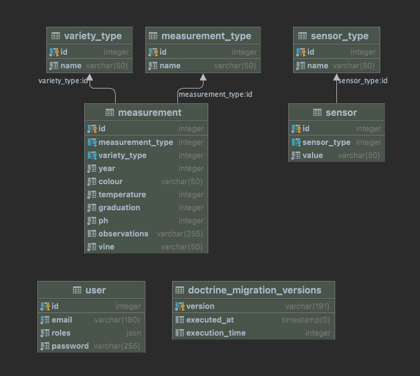

# 🍷 Catálogo Vinos

---

<a href="#"></a>


---

## 🚀 Instalación

### 🐳 Herramientas necesarias

1. [Instalar Docker](https://www.docker.com/get-started)
2. Clona este proyecto: `https://github.com/sefhirot69/wine_tasting.git`
3. __Opcional__: Instalar el comando `make` para mejorar el punto de entrada a nuestra aplicación.
    1. [Instalar en OSX](https://formulae.brew.sh/formula/make)
    2. [Instalar en Window](https://parzibyte.me/blog/2020/12/30/instalar-make-windows/#Descargar_make)
    

### 🔥 Ejecutar aplicación

1. Escribe por terminal el comando `make`. Este comando instalara todo lo necesario para arrancar la aplicación, junto con su base de datos.
    1. ***Opcional*** - Si no tenéis el comando `make`, ejecuta `docker-compose up -d` y luego instala las dependencias dentro del contenedor generado con `composer install`.
    2. ***Opcional*** - Luego dentro del contenedor ejecuta los siguientes comandos para tener datos en la base de datos en el siguiente orden:
       1. `php bin/console doctrine:migration:migrate`
       2. `php bin/console doctrine:fixtures:load -q`
2. La web estará disponible en la siguiente url [http://localhost:90](http://localhost:90/login)
   

### ✅ Ejecución de Tests

1. Para ejecutar todos los tests `make test`

### 🦌 Comandos útiles __Makefile__ ###
* Comandos útiles:
    * Este comando `make deps` instala todas las dependencias y resetea los datos de la base de datos.
    * `make lint` Aplica al código los estándares @PSR12 y @Symfony
    * `make lint-diff` Puedes ver los cambios que se van aplicar para cumplir con el estandar.
* Comandos composer:
    * `make composer-install`
    * `make composer-update`
    * `make composer-require module="[paquete]"` o `make composer-require module="[paquete] --dev"`
* Comandos symfony:
    * Limpiar cache `make clear`

## 🏘 Estructura

### 🌳 Estructura de la app

```
.
├── Measurements
│   ├── Application
│   │   └── ListMeasurementsQueryHandler.php
│   ├── Domain
│   │   ├── CharacteristicsMeasurements.php
│   │   ├── Dto
│   │   │   ├── CharacteristicsMeasurementsDto.php
│   │   │   ├── ListMeasurementsDto.php
│   │   │   ├── MeasurementTypeDto.php
│   │   │   ├── MeasurementsDto.php
│   │   │   └── VarietyTypeDto.php
│   │   ├── ListMeasurementsDataSource.php
│   │   ├── MeasurementType.php
│   │   ├── Measurements.php
│   │   └── VarietyType.php
│   └── Infrastructure
│       └── DoctrineListMeasurementsRepository.php
├── Shared
│   ├── Domain
│   │   ├── Exceptions
│   │   │   ├── InvalidPasswordException.php
│   │   │   ├── InvalidSignInEmailException.php
│   │   │   └── InvalidYearException.php
│   │   └── ValueObjects
│   │       ├── EmailValueObject.php
│   │       ├── PasswordValueObject.php
│   │       └── YearValueObject.php
│   └── Infrastructure
│       └── UserRepository.php
├── Signin
│   ├── Application
│   │   ├── SignInCommand.php
│   │   └── SignInCommandHandler.php
│   ├── Domain
│   │   ├── Dto
│   │   │   ├── SignInUserDto.php
│   │   │   └── SingInByEmailDto.php
│   │   ├── SignInDataSource.php
│   │   └── SignInEmailValueObject.php
│   └── Infrastructure
│       └── DoctrineSignInRepository.php
└── User
    ├── Application
    │   ├── RegisterUserCommand.php
    │   └── RegisterUserCommandHandler.php
    ├── Domain
    │   ├── Dto
    │   │   ├── UserDto.php
    │   │   ├── UserHashPasswordDto.php
    │   │   └── UserRegisterDto.php
    │   ├── Exceptions
    │   │   └── EmailNotFoundException.php
    │   ├── UserDataSource.php
    │   └── UserHashPasswordDataSource.php
    └── Infrastructure
        └── SymfonyUserHashPasswordRepository.php

```

### ✅  Estructura de los test

De momento son todos los tests unitarios. Pero en el futuro se dividiran en Unitarios, Funcionales y de Intergración.

```
├── WineTasting
│   ├── Measurements
│   │   └── Infrastructure
│   │       └── DoctrineListMeasurementsRepositoryTest.php
│   ├── Shared
│   │   └── Infrastructure
│   │       └── UserRepositoryTest.php
│   ├── Signin
│   │   ├── Application
│   │   │   └── SignInCommandHandlerTest.php
│   │   └── Infrastructure
│   │       └── DoctrineSignInRepositoryTest.php
│   └── User
│       ├── Application
│       │   └── RegisterUserCommandHandlerTest.php
│       └── Infrastructure
│           └── SymfonyUserHashPasswordRepositoryTest.php
└── bootstrap.php

```

### 🗄️ Estructura de la base de datos

